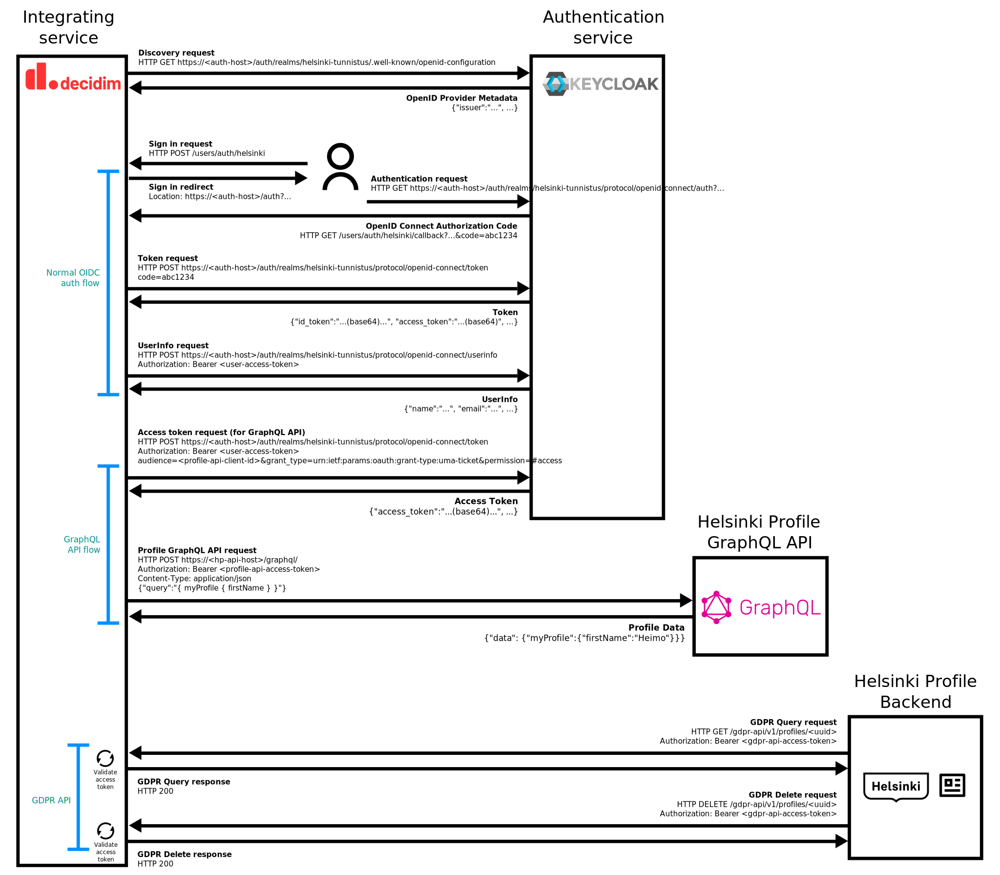

# Helsinki profile overview for integration developers

When implementing this module, the information related to Helsinki profile
seemed scattered onto multiple pages and it was not straight forward how the
integration should work without understanding the whole architecture of the
Helsinki profile system. This document collects some remarks aimed for
devleopers implementing an integration to Helsinki profile. It is meant to serve
as a general overview for developers to get an understanding of the whole
integration more quickly than browsing through dozens of documentation pages
and handful of different GitHub repositories.

This documentation assumes a direct integration with the Keycloak authentication
server as it simplifies this integration quite a bit. Alternative way to
implement the Helsinki profile integration is by using Tunnistamo as the
authenticating entity in case the service needs to preserve the user IDs (`uid`)
for old users. To keep things as simple as possible, we focus on the direct
Keycloak implementation as it is defined as the preferred way for new services.

## Helsinki profile from integrating service point of view

Helsinki profile integration consists of the following parts:

1. OpenID Connect authentication for authenticating the users.
2. Helsinki profile GraphQL API integration to fetch (verified) details about
   the user that are not provided by the OpenID Connect's UserInfo endpoint.
3. GDPR API implementation at the integrating service side which allows external
   calls from Helsinki profile to perform GDPR requests for the user (i.e.
   personal data requests and profile deletion requests).

All of these are needed when the integrating service utilizes and stores the
information related to the profiles and passed onto the service from Helsinki
profile. Preferrably the strong identity information passed onto the service
through the Helsinki profile GraphQL API should not be stored locally unless it
is necessary from the integrating service's point of view.

The following diagram shows an overview how all this works using the direct
Keycloak authentication what this integration is based on:



The Decidim integration (i.e. this integration) stores the strong identity
information locally in
[Decidim authorizations](https://docs.decidim.org/en/develop/customize/authorizations.html)
that are epherimental by their nature. These authorizations have an expiration
period and they are removed from the Decidim database once this information is
no longer needed. The expiration time should be defined by the platform's
product team or the product owner. For example, we could preserve the
information for 3 months in total which would mean that it is available for 2
months after a voting ends.

The authorizations within Decidim can be used, for instance, to check that the
user is eligible to vote in a participatory budgeting voting and that the same
person is not casting multiple votes, e.g. one digital vote and one physically
assisted vote. The authorization information can be bound to an identifier that
is unique to that person, no matter if they have been identified digitally or
phsically, that is the Finnish national identification number. The data provided
by the Helsinki profile GraphQL API can be also used for other purposes during
the participatory budgeting voting, such as identifying the correct voting area
for the user based on their postal code.

### OpenID Connect authentication (OIDC)

The authentication part of the implementation is straight forward and can be
implemented using any existing OpenID Connect (OIDC) authentication libraries.
This integration uses the
[`OmniAuth::OpenIDConnect`](https://github.com/omniauth/omniauth_openid_connect)
gem to take care of the OIDC authentication flows. That gem relies on
[`OpenIDConnect`](https://github.com/nov/openid_connect) to perform the message
exchange/preparation/parsing with the underlying OpenID Connect server.

The OpenID Connect layer is well documented and generally the implementor can
utilize the authentication library to take care of the normal authentication
flows. For more information, refer to:

https://openid.net/specs/openid-connect-core-1_0.html

The default implementation does not support passing the preferred locale of the
user to the authentication server which should match the language that the user
used at connecting service's side (for this integration, Decidim). If the
language of the user interface changes when the user is redirected to the
authentication service, it can confuse users and therefore cause accessibility
issues. Therefore, the default OmniAuth strategy has been extended within this
integration to support this feature.

Note that the email address returned by the OIDC user info data is verified by
Helsinki profile itself. Not all underlying authentication services provide a
verified email address (such as Suomi.fi) but Helsinki profile should take care
of verifying the email. However, due to past experiences, we have prepared the
Decidim integration so that we do not necessarily need to trust the email
address forwarded by Helsinki profile, if for example the authentication flow is
changed at the Helsinki profile's end. The non-verified email address
authentication flow can be supported with a simple configuration change.

Another unclear thing within a monolith application from the Helsinki profile
service integration from was the suggested `/silent` endpoint which is not
really used within Decidim as the user's session is managed within the service
itself. From Decidim's perspective (i.e. a monolith perspective) it should not
normally matter if the authentication session expires at the authentication
server while they are performing actions at the target service. Decidim handles
the session expiry itself and also signs out users automatically if they leave
the service unused for a long time (configurable).

One thing to note from a monolith perspective is that the sign out / logout
requests should perform the SSO logout at Helsinki profile and not only sign the
user out from the current service (i.e. Decidim). The sign out flow has been
implemented in this module following this guideline.

### Helsinki profile GraphQL API integration to fetch details about the user

The Helsinki profile GraphQL API for fetching details about the user is
implemented at Helsinki's side. All requests to this API need to be authorized
using an access token issued by the Helsinki authentication service (i.e. the
Keycloak server).

The test API is available with a GraphiQL client at:

https://profile-api.test.hel.ninja/graphql/

This can be used to get information about the provided GraphQL types that can be
developed against. These types have been also duplicated to this module for
easier local unit and integration testing.

This is also the URI for the GraphQL endpoint that should be connected to when
fetching user the user details that are not available at the OpenID connect's
UserInfo endpoint.

#### Authenticating with the GraphQL API

All requests to the Helsinki profile GraphQL API need to be authorized using a
separate authentication token from the one that is returned during the user's
normal authentication flow. A new token needs to be fetched from the OpenID
Connect server's (Keycloak) token endpoint, i.e. the `token_endpoint` available
at the OpenID Connect Discovery metadata. With Keycloak, the format of this URI
is `https://<host>/auth/realms/<realm>/protocol/openid-connect/token`. The
`<host>` part of the URI is the target environment's hostname and the `<realm>`
part is the realm configured at the Keycloak server, typically
`helsinki-tunnistus`.

This endpoint expects an HTTP POST request with the Content-Type
`application/x-www-form-urlencoded` and the following data within the body of
the request:

```
audience=<profile-api-client-id>
grant_type=urn:ietf:params:oauth:grant-type:uma-ticket
permission=#access
```

The `<profile-api-client-id>` should be replaced with the assigned profile
client ID for the target environment you are connecting to. The correct client
ID for each environment is documented at the Helsinki profile's documentation
regarding "Keycloak authentication and access tokens".

Once you have successfully received a token, you can now authorize the GraphQL
endpoint requests by using that token within the `Authorization` header of the
request.

A sample HTTP request to the endpoint should look as follows:

```
POST /graphql/ HTTP/1.1
Host: profile-api.test.hel.ninja
Authorization: Bearer <profile-api-auth-token>
Content-Type: application/json

{"query":"{ myProfile { firstName } }"}
```

#### Sample GraphQL queries

A sample query against this API that provides all the data needed to authorize
that the user is eligible for voting:

```graphql
{
  myProfile {
    verifiedPersonalInformation {
      nationalIdentificationNumber
      municipalityOfResidenceNumber
      permanentAddress { postalCode }
    }
  }
}
```

A sample query to fetch other data related to the account that may be useful in
other contexts (however, these sample details should be generally available also
at the OpenID connect's UserInfo endpoint):

```graphql
{
  myProfile {
    firstName
    lastName
    nickname
    primaryEmail { email verified }
  }
}
```

A full query that contains all of this information at the same time:

```graphql
{
  myProfile {
    firstName
    lastName
    nickname
    primaryEmail { email verified }
    verifiedPersonalInformation {
      firstName
      givenName
      lastName
      nationalIdentificationNumber
      municipalityOfResidenceNumber
      permanentAddress { postalCode }
    }
  }
}
```

### GDPR API implementation at the integrating service side

The GDPR API part was a bit confusing to start with. The simple way to put it is
that the integrating service should implement two endpoints that Helsinki
profile can call to perform GDPR requests:

1. User information endpoint to fetch all details the service stores about the
   user (GDPR right of accessing the data and right to data portability).
2. User deletion endpoint to perform the user deletion in the services that
   store their data (GDPR right to be forgotten).

The further documentation on how these endpoints should perform is available at:

https://profile-api.dev.hel.ninja/docs/gdpr-api/

Further in this documentation, we also explain them in detail on the parts that
may be unclear from that documentation alone.

#### Authentication

First and foremost, all GDPR API requests contain an `Authorization` header
containing an OpenID Connect access token to verify that the requests have been
authorized by the underlying authentication server. The integration takes care
of verifying these tokens are valid and have been issued by the connected
authentication server for the defined audience (i.e. the GDPR API client).

The access token validation process is documented here:

https://profile-api.dev.hel.ninja/docs/gdpr-api/

Note particularly that the token's "audience" (`aud`) is the GDPR API client as
defined by the Helsinki profile team. This client ID should be documented at the
service integration page documentation.

Once the access token is validated, the endpoints should perform the GDPR
requests as documented on the above mentioned page for the endpoints and respond
with the specified HTTP codes. In case the token is invalid, the HTTP response
code should be 401 as specified in the documentation linked above.

#### Endpoints

The GDPR API should implement two separate endpoints as described by the GDPR
API documentation:

- `GET {base_path}/<uuid>` - To fetch the information stored by the service that
  is bound to a specific user or profile identifier at Helsinki profile.
- `DELETE {base_path}/<uuid>` - To delete the user's profile and all personal
  data stored locally that is related to that user.

From the documentation and browsing through the example implementations or other
service integration pages, it was unclear what the base path should be for these
endpoints. It turned out that the implementing service can choose the URL
structure of these endpoints as long as they follow the specification. The only
limitation for the paths is that the URLs can have only one changing part, which
is the UUID, i.e. the unique identifier for the user or the profile to be
managed.

It is also up to the implementation whether the `<uuid>` refers to the user's
UUID or the profile's UUID which are different at the Helsinki profile's end. As
long as this is documented in the service integration page, the integrating
service can choose which of these identifiers fits best for the particular
implementation.

The Decidim integration chose `/gdpr-api/v1/profiles` as the base path, so the
endpoints for the GDPR API is `/gdpr-api/v1/profiles/<uuid>` which accepts both
`GET` and `DELETE` requests. This was provided as an example in some of the
documentation pages and the linked repositories that show how to implement and
utilize the API. The Decidim integration uses the user's UUID as the `<uuid>`
identifier within these URIs.

#### Data format

The data format for the `GET /gdpr-api/v1/profiles/<uuid>` response was not well
documented anywhere but we found this comment in the Python integration library:

https://github.com/City-of-Helsinki/helsinki-profile-gdpr-api/blob/808dcd30a745f6d18cdf36ccaf07b0cd25844ab0/helsinki_gdpr/models.py#L38-L63

It provides the following type of JSON example for the data to be returned by
the endpoint (the example is serializing a blog `POST` object with its details
and `COMMENTS` as its child objects, i.e. children):

```json
{
  "key": "POST",
  "children": [
    { "key": "TITLE", "value": "Post about serialization" },
    { "key": "CONTENT", "value": "This is the content of the post" },
    { "key": "CREATED_AT", "value": "2020-02-03" },
    { "key": "COMMENTS", "children": [
      {
        "key": "COMMENT"
        "children": [
          { "key": "TEXT", "value": "I really like this post" },
          { "key": "AUTHOR", "value": "Mike" }
        ]
      },
      {
        "key": "COMMENT"
        "children": [
          { "key": "TEXT", "value": "I don't agree with this 100%" },
          { "key": "AUTHOR", "value": "Maria" }
        ]
      }
    ]}
  ]
}
```

We have assumed that this is the expected format and the key names for the data
fields can be chosen by the implementation. At the time of writing this
documentation this could not be tested because of some limitations at the
Helsinki profile's end when using the direct Keycloak authentication flow as
described in this documentation. Also the GDPR API Tester tool does not seem to
validate the data format in any way, it just prints it out.

This integration utilizes the data serialization API provided by the Decidim
framework itself and converts the Decidim export format to the type of format
as shown in the example above. The hierarchican structure (parent -> child) with
the Decidim objects is not always straight forward as e.g. comments can be
attached to many different types of objects and it would make the data fetching
less performant if we were to fetch comments individually for each and every
object out there. Instead, we return comments as their own data type which
contains the information to which type of object that comment is for (i.e. the
commentable association).
